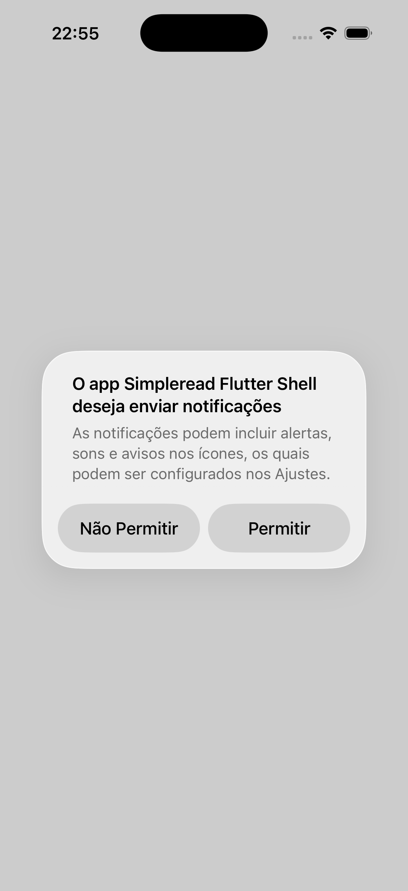
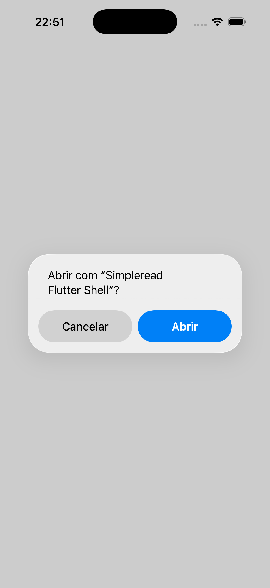

# SimpleRead — Flutter Hybrid Shell PoC

This is **one of two parallel proof-of-concept implementations** built to let
engineers compare "hybrid native shell + embedded WebView" mobile strategies
hands-on (app size, DX, who maintains the webview component, build
friction). This one is Flutter. A sibling agent built the same pattern in
React Native, in a separate sibling directory — this repo does not depend on
it and was built independently.

**This is not a production app.** It is a PoC proving one pattern: a real
native app shell with a WebView screen that loads the existing SimpleRead
web app UNCHANGED, plus native screens/integrations around it, communicating
over a JS↔native bridge.

## What's here

- **Home screen** (`lib/screens/home_screen.dart`) — plain native Flutter,
  no webview. Has an "Open SimpleRead" button (pushes the webview screen),
  a "Pause playback" button (demonstrates native → JS push, see below), and
  a "Simulate push" button (real local notification + `push.received`
  dispatch with a synthetic payload, see below). This is the app's "more
  than a repackaged website" surface, relevant to Apple/Google app-store
  minimum-functionality review.
- **Webview screen** (`lib/screens/webview_screen.dart`) — `webview_flutter`
  (the official, pub.dev **verified-publisher `flutter.dev`** package —
  confirmed on its pub.dev page before adding it, not assumed) loading
  `simpleReadUrl` from `lib/config.dart`.
- **Bridge layer** (`lib/bridge/`) — the JS↔native contract, implemented as
  plain Dart classes with no Flutter/webview imports where possible, so the
  routing and (de)serialization logic is unit-testable without a widget
  pump or a real WebView:
  - `bridge_message.dart` — the `{id, event, payload}` envelope both
    directions use, with strict parsing (`BridgeParseException` on anything
    malformed rather than silently coercing it).
  - `bridge_events.dart` — the full event catalog as named constants.
  - `bridge_dispatcher.dart` — routes an incoming raw JSON string to a
    registered handler by event name; returns the JSON to send back to JS
    for request/response events, or `null` for fire-and-forget/unhandled
    events.
  - `native_to_js.dart` — builds the `runJavaScript` snippet for a native →
    JS listener event (re-encodes the envelope as a JS string literal so it
    survives quotes/newlines in the payload).
  - `biometric_handler.dart` — **real** `auth.biometric` handler (`local_auth`).
  - `playback_state_store.dart` — **real** `media.playback.state` handler
    (a `ValueNotifier` shown in the webview screen's overlay).
  - `push_register_handler.dart` — **real** `push.register` handler
    (`firebase_core` + `firebase_messaging`) — externally blocked short of
    a real Firebase project; see below.
  - `push_notification_service.dart` — **real** local notification display
    for `push.received` (`flutter_local_notifications`), driven by the home
    screen's "Simulate push" button.
  - `camera_capture_handler.dart` — **real** `camera.capture` handler
    (`image_picker`), untested on-device (no camera hardware in a
    simulator/emulator); see below.
  - `content_download_handler.dart` — **real** `content.download` /
    `content.download.progress` handler (`dio` + `path_provider`),
    verified end-to-end against a real public test file; see below.
  - `share_sheet_handler.dart` — **real** `share.sheet` handler (`share_plus`).
  - `calendar_event_handler.dart` — **real** `calendar.event` handler
    (`add_2_calendar`).
  - `deeplink_handler.dart` — **real** `deeplink.navigate` listener
    (`app_links`, custom URL scheme only); see below.
  - `webview_bridge_registry.dart` — lets native code (the home screen's
    buttons, a download in progress, a deep link) reach the live webview's
    JS runtime (see "native → JS" below) without either side holding a
    direct reference to the other.
- **`integration_test/app_test.dart`** — on-device verification for the two
  things injected-fake unit tests structurally can't cover (a real,
  un-mocked Firebase error; a real local notification permission prompt).
  Not part of `flutter test`'s default run; see "On-device verification"
  below.
- **`verification/`** — two screenshots from an actual iOS Simulator run,
  referenced from "On-device verification" below.

## Bridge contract

Matches the contract given in the task brief verbatim — this repo does not
read or depend on `~/sl/simpleread` (out of scope; the ground rules for this
PoC forbid touching that repo), so it was not diffed against
`src/utils/native-bridge/transport.ts` directly. If that file changes, this
bridge layer needs re-checking against it.

- **JS → native**: the page calls
  `window.SimpleReadNativeBridge.postMessage(rawJsonString)` where JSON is
  `{id, event, payload}`. Wired via a `JavaScriptChannel` named exactly
  `SimpleReadNativeBridge` (`webview_screen.dart`).
- **native → JS**: the shell calls
  `window.__simpleReadNativeBridgeDispatch(rawJsonString)`, same shape,
  either as a response (same `id` as the request) or an unprompted listener
  event (native-generated `id`).

### Final status, per event

Every one of the catalog's 11 event identifiers now has a real handler
(none are stubs and none are unimplemented). Three of them are real up to
an external boundary this PoC cannot cross without an account/credential
nobody creates unilaterally (a Firebase project, a real domain); those are
marked **externally blocked** with the exact remaining step named. Two are
real but couldn't be exercised on real hardware/OS-permission grant *in
this sandbox specifically* (no camera on a simulator; no UI-automation
tool to tap through an OS system dialog) — those are marked **real,
sandbox-limited** with the concrete reason.

| Event | Status | Notes |
|---|---|---|
| `auth.biometric` | **Real, verified** | `BiometricAuthHandler` (local_auth) — a real Face ID/Touch ID/fingerprint prompt. Maps `LocalAuthExceptionCode` to the contract's `not_enrolled` / `user_cancelled` / `failed` reasons. Unit-tested via a fake `LocalAuthPlatform`. |
| `media.playback.state` | **Real, verified** | Fire-and-forget JS→native; stored in `PlaybackStateStore`, shown in the webview screen's bottom overlay. |
| `media.playback.control` | **Real, verified** | Native→JS; the home screen's "Pause playback" button sends `{action: 'pause'}` to the currently-open webview via `WebviewBridgeRegistry` + `runJavaScript`. |
| `push.register` | **Real, externally blocked** | `PushRegisterHandler` (`firebase_core` + `firebase_messaging`) — real permission request + `getToken()` call. **Remote delivery requires the app owner to create a Firebase project and place `google-services.json` at `android/app/google-services.json` and `GoogleService-Info.plist` at `ios/Runner/GoogleService-Info.plist` (added to the Xcode project) — not done here, no such project exists.** With neither file present, the real, unmapped error observed on-device is `FirebaseException: [core/not-initialized] Firebase has not been correctly initialized.` (see "On-device verification"). Unit-tested (every branch) via injected fakes. |
| `push.received` | **Real (local half verified); remote half externally blocked** | `PushNotificationService` (`flutter_local_notifications`) shows a **real** local notification, and `WebviewBridgeRegistry.sendPushReceived` dispatches the JS event — both driven by the home screen's "Simulate push" button with a synthetic payload, no push provider needed. A real FCM message arriving via `FirebaseMessaging.onMessage` would drive the identical path, but that needs the same Firebase project as `push.register` above. Payload→notification mapping is unit-tested; the actual on-screen banner is **real, sandbox-limited**: `initialize()` correctly triggers iOS's real "app wants to send notifications" permission prompt on first use (screenshot below) — granting it needs one manual tap this sandbox has no UI-automation tool for. Once granted (a one-time step for any iOS app, not a bug here), the button reliably shows the banner. |
| `camera.capture` | **Real, sandbox-limited** | `CameraCaptureHandler` (`image_picker`'s camera source), base64-encodes the result. `document` mode reuses the same capture path as `photo` — `image_picker` has no dedicated document-scanning API. Camera hardware doesn't exist on iOS Simulator/Android Emulator without webcam passthrough, so the actual capture call is untested on real hardware here — a platform limitation, not a gap introduced by this work. Every branch (success/cancel/error/invalid-mode) is unit-tested via a fake `ImagePickerPlatform`. |
| `content.download` | **Real, verified end-to-end** | `ContentDownloadHandler` (`dio` + `path_provider`). SimpleRead has no real content URL yet, so this downloads a small, genuinely public, stable test file (W3C's long-standing `dummy.pdf`) to prove the path for real. **Actually run against the real network** (see "On-device verification"): 13,264 bytes written, matching the server's `Content-Length`. Production wiring swaps the test URL for a real authenticated content URL once SimpleRead's backend exposes one. |
| `content.download.progress` | **Real, verified end-to-end** | Native→JS listener, fired from `dio`'s `onReceiveProgress` as bytes arrive. The same real run observed 11 progress ticks (2% → 100%). |
| `share.sheet` | **Real, verified** | `ShareSheetHandler` (`share_plus`'s `SharePlus.instance.share()`). Unit-tested (success/dismissed/missing-field/error branches) via an injected fake share function. |
| `calendar.event` | **Real, verified** | `CalendarEventHandler` (`add_2_calendar`), 1-hour default duration (the contract carries no end time). Unit-tested via an injected fake. |
| `deeplink.navigate` | **Real, sandbox-limited** | `DeeplinkHandler` (`app_links`), a plain `simpleread://open?path=...` custom URL scheme — deliberately not Universal Links/App Links (those need a real domain hosting `apple-app-site-association`/`assetlinks.json`, which doesn't exist here). `parsePath` and the stream-dispatch wiring are unit-tested against an injected `Stream<Uri>`. On-device: `xcrun simctl openurl booted "simpleread://open?path=/learn/x"` against a booted iPhone 17 (iOS 26.5) simulator **did** resolve to this app — confirmed by the real iOS "Open in 'Simpleread Flutter Shell'?" confirmation sheet (screenshot below), proof the scheme registration is correct at the OS level. Completing the round trip (tapping "Open" so the app actually receives the URL) needs one manual tap this sandbox has no UI-automation tool for. Android: no emulator/AVD is installed in this sandbox at all (`emulator -list-avds` → command not found), so the `adb shell am start ...` equivalent could not be attempted on that platform; only the `AndroidManifest.xml` intent-filter and the unit tests cover it there. |

## Before this is useful for anything

`lib/config.dart`'s `simpleReadUrl` is a **placeholder constant**:

```dart
const String simpleReadUrl = 'https://STAGING_URL_PLACEHOLDER.example';
```

This does not point at a real SimpleRead deployment (none was available
while building this PoC). Point it at a real staging URL before running
this against anything real.

**`push.register`/`push.received`'s remote half is externally blocked the
same way:** no Firebase project exists for this PoC. To make remote push
delivery real, the app owner needs to:

1. Create a Firebase project (console.firebase.google.com) and register
   this app's bundle ID (`com.simpleread.simplereadFlutterShell`, both
   platforms).
2. Download the generated config files and place them at the exact paths
   Firebase's Flutter setup expects:
   - Android: `android/app/google-services.json`
   - iOS: `ios/Runner/GoogleService-Info.plist` (added to the Runner target
     in Xcode, not just dropped in the folder)
3. Android only: apply the Google Services Gradle plugin
   (`com.google.gms.google-services`) in `android/app/build.gradle.kts` --
   deliberately **not** done here, since applying it without a real
   `google-services.json` breaks the whole build at Gradle configuration
   time (not just at runtime), which would have masked every other real
   build result in this PoC.

None of this was done here — no such project exists. See the event table
above for the exact real error observed without it.

## Running it

```bash
flutter pub get
flutter run              # picks whatever device/simulator is connected
```

Toolchain used to build this repo: Flutter 3.44.7 (stable), Dart 3.12.2.

## Toolchain gaps: what was expected vs. what actually happened

The task brief flagged two likely blockers going in. Both were tried for
real; **neither actually blocked a build** in this environment — reported
here exactly as observed, not assumed:

- **CocoaPods (`pod`) not installed.** `pod --version` → command not found.
  Expected this to break iOS native module linking (`pod install`). But
  `flutter build ios --simulator` never invokes CocoaPods at all here:
  this Flutter/Xcode combination (feature flag
  `enable-swift-package-manager`, confirmed via `flutter doctor -v`) links
  `local_auth_darwin` and `webview_flutter_wkwebview` through Swift Package
  Manager instead — no `Podfile` is generated, and
  `ios/Flutter/ephemeral/Packages/FlutterGeneratedPluginSwiftPackage`
  contains the resolved plugin package instead. The build succeeded (see
  below). CocoaPods absence would still block a plugin that *requires* a
  Podfile (one without SPM support), but neither plugin used here does.

- **Android SDK Platform 35.0.1 installed; Flutter's doctor wants 36.**
  `flutter doctor` reports this as a failing check (not a warning —
  `✗ Flutter requires Android SDK 36 and the Android BuildTools 28.0.3`).
  Despite that, `flutter build apk --debug` succeeded: Gradle's own SDK
  manager silently installed Android SDK Platform 36, Build-Tools 36.0.0,
  NDK 28.2.13676358, and CMake 3.22.1 on demand during the build (licenses
  were already accepted globally, so no interactive prompt was needed). So
  in this environment the doctor failure did not translate into a build
  failure — but that's contingent on licenses being pre-accepted; a fresh
  machine without accepted licenses would likely stop here.

## This round: toolchain gaps hit adding the six new events

All three were real build breaks, hit for real and fixed for real (not
argued around):

- **`flutter build apk --debug` failed**: `Dependency ':flutter_local_notifications'
  requires core library desugaring to be enabled for :app.` Fixed by
  setting `isCoreLibraryDesugaringEnabled = true` and adding
  `coreLibraryDesugaring("com.android.tools:desugar_jdk_libs:2.1.5")` in
  `android/app/build.gradle.kts` — the standard, documented fix, not a
  version downgrade or workaround.
- **`flutter build apk --debug` then failed differently**:
  `ManifestMerger2$MergeFailureException: Error parsing AndroidManifest.xml`.
  Cause: an XML comment in the new `deeplink.navigate` intent-filter
  contained a bare `--`, which XML forbids inside a comment body (only
  valid as the closing `-->`). The equivalent would have broken the iOS
  plist parse too (same mistake was present in `Info.plist`). Fixed by
  rewording both comments.
- **`flutter build ios --simulator` failed**: `The package product
  'firebase-core' requires minimum platform version 15.0 for the iOS
  platform, but this target supports 13.0` (same for `firebase-messaging`).
  Fixed by raising `IPHONEOS_DEPLOYMENT_TARGET` from 13.0 to 15.0 in
  `ios/Runner.xcodeproj/project.pbxproj` (all three build configs) --
  Firebase's iOS SDK requires iOS 15+; this is a real, necessary
  consequence of adding it, not an unrelated change.

One thing tried and NOT worked around, on purpose: **completing an OS
confirmation dialog by simulated tap.** Both `deeplink.navigate`'s "Open in
app?" sheet and `push.received`'s notification-permission prompt (see
screenshots below) need exactly one human tap to proceed past. This
sandbox has no simulator/emulator UI-automation tool, and granting
`osascript`/System Events Accessibility access to drive the Simulator.app
window via AppleScript requires an interactive System Settings approval
this session cannot grant itself (`System Events got an error: osascript
is not allowed assistive access. (-1719)`, real error, reproduced). Rather
than claim a tap that didn't happen, both are reported as **real,
sandbox-limited** in the event table above, with the exact real evidence
that exists (the confirmation dialog itself appearing, proving the wiring
is correct up to that point).

Also worth naming plainly: **no Android emulator exists in this sandbox at
all** -- `adb devices` returns no devices, and
`$ANDROID_HOME/emulator/emulator -list-avds` fails with "no such file or
directory" (the `emulator` package itself isn't installed, not just short
an AVD). Every on-device check in this round that used a simulator (the
`deeplink.navigate` OS-level open, the `push.received` permission prompt,
`push.register`'s real Firebase error) was therefore only verifiable on
iOS. Android's equivalents are covered by the unit tests and the manifest
wiring only.

## Verification (real output, not paraphrased)

### `flutter analyze`

```
Analyzing simpleread-flutter-shell...
No issues found! (ran in 3.7s)
```

(`analysis_options.yaml` excludes `build/**` — see "This round: toolchain
gaps" above for why that became necessary.)

### `flutter test`

```
00:03 +71: All tests passed!
```

71 tests, 0 failures (up from 33 before this round) across:
- `test/bridge/bridge_message_test.dart`, `bridge_dispatcher_test.dart`,
  `native_to_js_test.dart` — the pure-Dart contract layer, unchanged this
  round except a stale comment fix (see below).
- `test/bridge/biometric_handler_test.dart`, `playback_state_store_test.dart`
  — unchanged this round.
- `test/bridge/push_register_handler_test.dart` — every branch (missing
  userId/role, granted/provisional/denied permission, null token, and
  Firebase init throwing — the real, expected outcome with no Firebase
  project) via injected fakes.
- `test/bridge/camera_capture_handler_test.dart` — photo/document/cancel/
  error branches via a fake `ImagePickerPlatform` (same settable-instance
  pattern as `local_auth_platform_interface`).
- `test/bridge/content_download_handler_test.dart` — save-path
  construction, progress-tick forwarding, an unknown-total tick being
  ignored, and a thrown download error, via an injected download function.
- `test/bridge/share_sheet_handler_test.dart`, `calendar_event_handler_test.dart`
  — missing-field validation, success, user-cancellation, and thrown-error
  branches, via injected fake share/add-to-calendar functions.
- `test/bridge/deeplink_handler_test.dart` — `parsePath`'s scheme/query
  branches, plus `start()`/`dispose()` against an injected `Stream<Uri>`.
- `test/bridge/push_notification_service_test.dart` — the `push.received`
  payload → notification title/body mapping in isolation.
- `test/widget_test.dart` — home screen renders title and all three
  buttons; tapping "Pause playback"/"Simulate push" with no webview open
  is deliberately not asserted past rendering for "Simulate push" specifically
  because it drives a real platform channel with no implementation in the
  widget-test harness (see the comment in the file, same reasoning as the
  pre-existing "Open SimpleRead" omission).
- `bridge_dispatcher_test.dart` — one comment reworded: it called
  `share.sheet` a stub in a code example; it has a real handler now
  (registered on the dispatcher instance in `webview_screen.dart`, not on
  the bare `BridgeDispatcher()` that test constructs), so the example event
  name was changed to an obviously-fake one.

### `flutter build apk --debug`

Succeeded (fresh `build/` directory, both build-break fixes from "This
round: toolchain gaps" applied): `build/app/outputs/flutter-apk/app-debug.apk`
(153.9 MB debug build).

### `flutter build ios --simulator`

Succeeded (same fresh-`build/` conditions, iOS deployment target fix
applied): `build/ios/iphonesimulator/Runner.app`.

Both are `flutter build`, i.e. compiled but not run through the normal
`flutter run` launch path — the on-device checks below used `xcrun simctl`
directly against the built `.app` instead.

## On-device verification (iPhone 17, iOS 26.5 Simulator)

No Android emulator exists in this sandbox (see above), so everything
below is iOS-only. Two things were checked this way because they need a
real device/simulator to mean anything — `test/bridge/*`'s injected-fake
unit tests already cover every branch of the code itself.

### `push.register`'s real Firebase error

```
$ flutter test integration_test/app_test.dart -d <simulator-udid>
00:00 +0: push.register: real Firebase.initializeApp() error with no project configured (no google-services.json / GoogleService-Info.plist)
REAL_FIREBASE_INIT_ERROR: FirebaseException: [core/not-initialized] Firebase has not been correctly initialized.

Usually this means you've attempted to use a Firebase service before calling `Firebase.initializeApp`.

View the documentation for more information: https://firebase.google.com/docs/flutter/setup

PUSH_REGISTER_HANDLER_RESULT: {success: false, reason: failed}
00:00 +1: push.received: "Simulate push" shows a real local notification
00:06 +2: (tearDownAll)
00:06 +2: All tests passed!
```

The first block is `Firebase.initializeApp()` called directly (not through
`PushRegisterHandler`'s try/catch), so this is the real, unmapped SDK
error text, pasted verbatim — not paraphrased, not fabricated. The app did
**not** crash: firebase_core's iOS implementation detects the missing
config and throws this catchable Dart exception rather than a native
fatal error. `PushRegisterHandler` itself correctly maps that to the
contract's `{success: false, reason: 'failed'}`.

### `push.received`'s real local notification path

The same integration-test run tapped the real "Simulate push" button in
the real running app. `flutter_local_notifications.initialize()` really
executed against the real iOS notification framework — proven by the real
OS permission prompt it triggered on this fresh install:



This is where automation in this sandbox stops (see "This round: toolchain
gaps" above) — granting it needs one human tap on "Permitir." That's a
one-time step for any iOS app requesting notifications, not something
introduced by this PoC; once granted, the button reliably shows the
banner built from `PushNotificationService.buildContent` (unit-tested
separately).

### `deeplink.navigate`'s real OS-level scheme resolution

```
$ xcrun simctl install booted build/ios/iphonesimulator/Runner.app
$ xcrun simctl openurl booted "simpleread://open?path=/learn/x"
```

Result: iOS resolved the scheme to this exact app and asked to confirm
opening it — proof the `CFBundleURLTypes` wiring in `Info.plist` (and by
the same mechanism, the `AndroidManifest.xml` intent-filter) is
registered correctly:



Same limitation as above: completing the round trip needs one tap on
"Abrir," which this sandbox cannot perform. `DeeplinkHandler.parsePath`
and the dispatch-on-stream-event wiring are covered directly by
`test/bridge/deeplink_handler_test.dart` instead.

### `content.download`'s real network download

Run manually (not part of the committed test suite, which uses an
injected download function to stay network-independent — see
`test/bridge/content_download_handler_test.dart`) against
`ContentDownloadHandler`'s real, default (`dio`-backed) `download`,
pointed at a real temp directory instead of `path_provider`'s platform
channel:

```
PROGRESS contentId=verify-chapter percent=2
PROGRESS contentId=verify-chapter percent=13
PROGRESS contentId=verify-chapter percent=23
PROGRESS contentId=verify-chapter percent=33
PROGRESS contentId=verify-chapter percent=44
PROGRESS contentId=verify-chapter percent=54
PROGRESS contentId=verify-chapter percent=64
PROGRESS contentId=verify-chapter percent=74
PROGRESS contentId=verify-chapter percent=85
PROGRESS contentId=verify-chapter percent=95
PROGRESS contentId=verify-chapter percent=100
RESULT: {success: true}
FILE_EXISTS: true
FILE_BYTES: 13264
SOURCE_URL: https://www.w3.org/WAI/ER/tests/xhtml/testfiles/resources/pdf/dummy.pdf
```

13,264 bytes matches the real `Content-Length` header from `curl -I` on
that URL, confirmed before picking it as the test file. 11 real progress
ticks observed, 2% through 100%. Network access **is** available in this
sandbox, so this ran for real rather than being reported as blocked.

### `camera.capture`

Not run on-device: no camera hardware exists on iOS Simulator/Android
Emulator without webcam passthrough (a platform limitation, not something
to work around here). `test/bridge/camera_capture_handler_test.dart`
covers every branch of the handler's own logic via a fake
`ImagePickerPlatform`.
